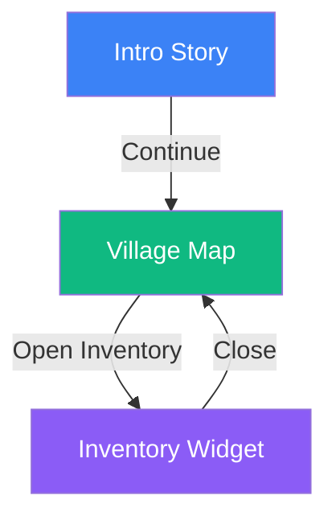
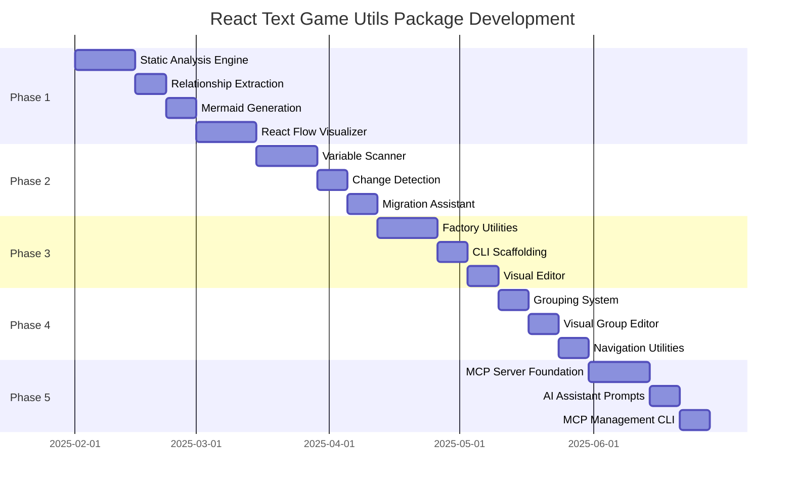

# React Text Game Utils Package - Roadmap

## Overview

The utils package provides developer tools for managing, visualizing, and creating passages and game state in React Text Game projects. It aims to enhance the development experience with visual editors, schema management, migration detection, and AI integration capabilities.

## Project Goals

1. **Passage Discovery & Visualization** - Automatically detect and visualize passage relationships
2. **Variable Tracking & Migrations** - Track game state changes and assist with migration creation
3. **Developer Experience** - Provide tools for easier passage creation and management
4. **AI Integration** - Enable AI-powered development through MCP servers

---

## Phase 1: Passage Schema Detection & Visualization

**Timeline:** 4-6 weeks
**Priority:** High
**Status:** Not Started

### Goals

Create a comprehensive system for discovering, analyzing, and visualizing game passages from TypeScript and MDX source files.

### Milestones

#### 1.1 Static Analysis Engine (Week 1-2)

**Features:**
- TypeScript AST parser to detect passage factory calls
  - `newStory(id, content, options)`
  - `newInteractiveMap(id, options)`
  - `newWidget(id, content)`
- MDX frontmatter parser for MDX-based passages
- Configurable passage directories (optional)
  - Default: scan entire `src/` directory
  - User can specify specific folders (e.g., `src/passages`, `src/game/passages`)
  - Configuration stored in `.react-text-game/config.json`
- Extract core passage data from source:
  - `id` (required)
  - `type` (story, interactiveMap, widget)
  - `title` (optional, from MDX frontmatter or options)
- Store extended metadata separately in `.react-text-game/metadata/` folder:
  - `tags` (user-defined categories)
  - `description` (passage description)
  - `position` (visual editor position)
  - `customMetadata` (extensible object)

**Technical Approach:**
```typescript
// Core passage data extracted from source code
interface PassageSourceData {
  id: string;
  type: 'story' | 'interactiveMap' | 'widget';
  title?: string;
  filePath: string;
  lineNumber: number;
}

// Extended metadata stored separately
interface PassageExtendedMetadata {
  id: string; // Reference to passage
  tags?: string[];
  description?: string;
  position?: { x: number; y: number }; // For visual editor
  customMetadata?: Record<string, unknown>;
}

// Combined view for UI
interface PassageMetadata extends PassageSourceData {
  tags?: string[];
  description?: string;
  position?: { x: number; y: number };
  customMetadata?: Record<string, unknown>;
}

// Configuration
interface UtilsConfig {
  passageDirectories?: string[]; // Directories to scan for passages
  excludePatterns?: string[];    // Glob patterns to exclude
}

// Scanner API
class PassageScanner {
  async scanProject(rootDir: string, config?: UtilsConfig): Promise<PassageSourceData[]>;
  async scanFile(filePath: string): Promise<PassageSourceData[]>;

  // Default: scans src/ if no config provided
  // With config: scans only specified directories
}

// Metadata Manager
class MetadataManager {
  private metadataPath = '.react-text-game/metadata/passages.json';

  async loadMetadata(): Promise<Map<string, PassageExtendedMetadata>>;
  async saveMetadata(metadata: Map<string, PassageExtendedMetadata>): Promise<void>;
  async updatePassageMetadata(id: string, updates: Partial<PassageExtendedMetadata>): Promise<void>;

  // Merge source data with metadata
  mergeWithSourceData(
    sourceData: PassageSourceData[],
    metadata: Map<string, PassageExtendedMetadata>
  ): PassageMetadata[];
}
```

**Configuration & Metadata Storage Structure:**
```
.react-text-game/
|-- config.json             # Utils configuration
|-- metadata/
|   |-- passages.json       # Extended metadata for all passages
|   `-- groups.json         # Group definitions (Phase 4)
`-- layout.json             # Visual editor layout (deprecated, merged into passages.json)
```

**Example config.json:**
```json
{
  "passageDirectories": [
    "src/passages",
    "src/game/chapters"
  ],
  "excludePatterns": [
    "**/*.test.ts",
    "**/*.spec.ts",
    "**/utils/**"
  ]
}
```

**Example passages.json:**
```json
{
  "passages": {
    "intro": {
      "id": "intro",
      "tags": ["prologue", "tutorial"],
      "description": "Opening scene introducing the player to the world",
      "position": { "x": 100, "y": 100 },
      "customMetadata": {
        "author": "John Doe",
        "createdAt": "2025-01-15"
      }
    },
    "village": {
      "id": "village",
      "tags": ["location", "hub"],
      "description": "Central village where quests begin",
      "position": { "x": 300, "y": 100 }
    }
  }
}
```

**Dependencies:**
- `@typescript-eslint/typescript-estree` - TypeScript AST parsing
- `gray-matter` - MDX frontmatter parsing
- `glob` - File discovery

**Deliverables:**
- Scanner CLI command: `bun run utils:scan`
  - `bun run utils:scan` - Scans configured directories or entire src/
  - `bun run utils:scan --dir src/passages` - Override and scan specific directory
  - `bun run utils:scan --config` - Show current scan configuration
- Configuration management:
  - `bun run utils:config set-passages-dir src/passages src/chapters` - Set passage directories
  - `bun run utils:config add-exclude "**/*.test.ts"` - Add exclude pattern
  - `bun run utils:config init` - Create default config file
- Passage source data registry (JSON output with id, type, title)
- Metadata manager for extended metadata in `.react-text-game/metadata/`
- Type definitions for passage data and metadata
- CLI commands for metadata management:
  - `bun run utils:metadata set <passageId> --tags tag1,tag2`
  - `bun run utils:metadata add-tag <passageId> <tag>`
  - `bun run utils:metadata update <passageId> --description "..."`

#### 1.2 Passage Relationship Extraction (Week 2-3)

**Features:**
- Detect navigation relationships between passages
  - `Game.jumpTo(passageId)` calls in TypeScript files
  - `Game.jumpTo(passageId)` in MDX `<Action>` components' `onPerform` callbacks
  - Action callbacks with navigation logic
- Build passage dependency graph
- Identify orphaned passages (no incoming links)
- Detect circular dependencies

**Technical Approach:**
```typescript
interface PassageLink {
  sourcePassageId: string;
  targetPassageId: string;
  linkType: 'navigation' | 'action' | 'conditional';
  context?: string; // Code snippet where link is defined
}

interface PassageGraph {
  passages: PassageMetadata[]; // Merged source data + metadata
  links: PassageLink[];
  orphans: string[]; // Passage IDs with no incoming links
  entryPoints: string[]; // Passages with no outgoing links to them
}

// Graph builder merges source data with metadata
class PassageGraphBuilder {
  async buildGraph(rootDir: string, config?: UtilsConfig): Promise<PassageGraph> {
    // Load config from file if not provided
    const effectiveConfig = config || await this.loadConfig(rootDir);

    const sourceData = await passageScanner.scanProject(rootDir, effectiveConfig);
    const metadata = await metadataManager.loadMetadata();
    const passages = metadataManager.mergeWithSourceData(sourceData, metadata);
    const links = await this.extractLinks(rootDir, effectiveConfig);

    return {
      passages,
      links,
      orphans: this.findOrphans(passages, links),
      entryPoints: this.findEntryPoints(passages, links)
    };
  }

  private async loadConfig(rootDir: string): Promise<UtilsConfig> {
    // Load from .react-text-game/config.json or use defaults
    const configPath = path.join(rootDir, '.react-text-game/config.json');
    if (await exists(configPath)) {
      return JSON.parse(await readFile(configPath, 'utf-8'));
    }
    return { passageDirectories: ['src'] }; // Default
  }
}
```

**Deliverables:**
- Relationship extraction from TypeScript `Game.jumpTo()` calls
- MDX `<Action>` component analysis for navigation in `onPerform` callbacks
- AST parsing of callback functions to detect passage navigation
- Graph data structure with adjacency information
- Validation warnings for broken passage references

#### 1.3 Mermaid Schema Generation (Week 3)

**Features:**
- Generate Mermaid flowchart from passage graph
- Colorize nodes by passage type
- Show link labels and types
- Support subgraphs for grouped passages

**Technical Approach:**
```typescript
class MermaidGenerator {
  generate(graph: PassageGraph, options?: MermaidOptions): string;
}

interface MermaidOptions {
  direction?: 'TD' | 'LR' | 'RL' | 'BT';
  includeOrphans?: boolean;
  groupByTags?: boolean;
  theme?: 'default' | 'dark' | 'forest' | 'neutral';
}
```

**Example Output:**


**Deliverables:**
- Mermaid generator with customizable themes
- CLI command: `bun run utils:schema --format mermaid`
- HTML export with embedded Mermaid viewer
- SVG/PNG export via `@mermaid-js/mermaid-cli`

#### 1.4 React Flow Visual Editor (Week 4-6)

**Features:**
- Interactive passage graph visualization
- Drag-and-drop node positioning
- Click to open passage source file
- Real-time graph updates during development
- Export graph layout positions

**Technical Approach:**
- Use React Flow for node-based UI
- Custom node types for each passage type (story, map, widget)
- Custom edge styling with link type indicators
- Persist layout and metadata in `.react-text-game/metadata/passages.json`
- UI reads/writes metadata through MetadataManager
- Real-time sync between visual editor and metadata storage

**Component Structure:**
```typescript
// Custom node component displays merged data
const PassageNode: React.FC<NodeProps<PassageMetadata>> = ({ data }) => {
  // Visual representation showing:
  // - id, type, title (from source)
  // - tags, description (from metadata)

  const handleMetadataUpdate = async (updates: Partial<PassageExtendedMetadata>) => {
    await metadataManager.updatePassageMetadata(data.id, updates);
  };
};

// Main editor component
const PassageGraphEditor: React.FC = () => {
  const [nodes, setNodes, onNodesChange] = useNodesState([]);
  const [edges, setEdges, onEdgesChange] = useEdgesState([]);
  const [metadata, setMetadata] = useState<Map<string, PassageExtendedMetadata>>(new Map());

  useEffect(() => {
    // Load source data + metadata
    const loadGraph = async () => {
      const graph = await passageGraphBuilder.buildGraph('.');
      // Convert to React Flow nodes/edges
    };
    loadGraph();
  }, []);

  // Save position changes to metadata
  const handleNodeDragStop = async (event: MouseEvent, node: Node) => {
    await metadataManager.updatePassageMetadata(node.id, {
      position: node.position
    });
  };
};
```

**Dependencies:**
- `@xyflow/react` - React Flow library
- `zustand` - State management for editor
- `@react-text-game/core` - Types and integrations

**Deliverables:**
- Standalone React app for passage visualization
- Dev server: `bun run utils:visualize`
- Automatic save of positions/metadata to `.react-text-game/metadata/`
- Inline metadata editing (tags, description)
- Export graph as image
- Metadata panel for viewing/editing passage details

### Success Criteria

- Scans entire project and finds all passages (TypeScript + MDX)
- Generates accurate Mermaid diagrams
- React Flow visualizer displays passage graph
- Detects and warns about broken links
- Performance: Scans 100+ passages in <5 seconds

---

## Phase 2: Variable Tracking & Migration Detection

**Timeline:** 3-4 weeks
**Priority:** High
**Status:** Not Started

### Goals

Track game variable usage, detect structural changes, and assist developers in creating save data migrations.

### Milestones

#### 2.1 Variable Usage Scanner (Week 1-2)

**Features:**
- Scan for `Storage.getValue(jsonPath)` and `Storage.setValue(jsonPath, value)` calls
- Extract JSONPath patterns used in the project
- Detect entity variable definitions (`createEntity(id, variables)`)
- Build variable usage map showing:
  - Variable path (e.g., `$.player.health`)
  - Locations where read/written
  - Type inference from usage

**Technical Approach:**
```typescript
interface VariableUsage {
  path: string; // JSONPath (e.g., "$.player.health")
  type: 'read' | 'write' | 'both';
  locations: VariableLocation[];
  inferredType?: string; // TypeScript type if detectable
}

interface VariableLocation {
  filePath: string;
  lineNumber: number;
  context: string; // Code snippet
  operation: 'get' | 'set';
}

class VariableScanner {
  async scanProject(rootDir: string): Promise<VariableUsage[]>;
}
```

**Deliverables:**
- Variable usage scanner
- CLI command: `bun run utils:scan-vars`
- JSON report of all game variables
- Type definitions generator for common variables

#### 2.2 Change Detection & Diffing (Week 2-3)

**Features:**
- Compare current variable schema with previous version
- Detect schema changes:
  - New variables added
  - Variables removed
  - Variables renamed (heuristic detection)
  - Type changes
- Generate human-readable change report

**Technical Approach:**
```typescript
interface VariableChange {
  type: 'added' | 'removed' | 'renamed' | 'modified';
  oldPath?: string;
  newPath?: string;
  oldType?: string;
  newType?: string;
  confidence?: number; // For rename detection (0-1)
}

class VariableDiffer {
  diff(oldSchema: VariableUsage[], newSchema: VariableUsage[]): VariableChange[];
}
```

**Deliverables:**
- Schema differ with rename detection
- CLI command: `bun run utils:diff-vars --baseline .react-text-game/vars-baseline.json`
- Save baseline schemas for comparison
- Markdown change report

#### 2.3 Migration Assistant (Week 3-4)

**Features:**
- Alert developer when variable schema changes
- Generate migration template code
- Provide migration testing utilities
- Validate migrations against old saves

**Technical Approach:**
```typescript
interface MigrationDefinition {
  version: string;
  description: string;
  up: (oldState: GameSaveState) => GameSaveState;
  down?: (newState: GameSaveState) => GameSaveState;
}

class MigrationGenerator {
  generateTemplate(changes: VariableChange[]): string;
  validateMigration(
    migration: MigrationDefinition,
    testSaves: GameSaveState[]
  ): ValidationResult;
}
```

**Generated Migration Template:**
```typescript
// migrations/2025-01-15-rename-health.ts
import { GameSaveState } from '@react-text-game/core';

export const migration: MigrationDefinition = {
  version: '1.2.0',
  description: 'Rename player.health to player.hp',
  up: (state) => {
    // Auto-generated suggestion
    if (state.player?.health !== undefined) {
      state.player.hp = state.player.health;
      delete state.player.health;
    }
    return state;
  },
  down: (state) => {
    if (state.player?.hp !== undefined) {
      state.player.health = state.player.hp;
      delete state.player.hp;
    }
    return state;
  },
};
```

**Deliverables:**
- Migration generator CLI: `bun run utils:generate-migration`
- Migration template with suggested transformations
- Migration testing framework
- Integration with `@react-text-game/core/saves`

### Success Criteria

- Detects all variable read/write operations
- Accurately diffs variable schemas
- Generates valid migration templates
- Catches 90%+ of common schema changes
- Zero false positives for "no changes" scenarios

---

## Phase 3: Passage Creation Tools

**Timeline:** 3-4 weeks
**Priority:** Medium
**Status:** Not Started

### Goals

Provide utilities and helper functions to streamline passage creation and scaffolding.

### Milestones

#### 3.1 Passage Factory Utilities (Week 1-2)

**Features:**
- Enhanced factory functions with validation
- Type-safe passage builders with fluent API
- Template generation for common passage patterns
- Snippet library for common actions

**Technical Approach:**
```typescript
// Builder pattern for type-safe passage creation
class StoryBuilder {
  private config: StoryConfig = { id: '', content: () => [] };

  id(id: string): this;
  title(title: string): this;
  tags(...tags: string[]): this;
  background(url: string): this;
  addHeader(text: string, level?: number): this;
  addText(content: string): this;
  addActions(actions: Action[]): this;
  build(): ReturnType<typeof newStory>;
}

// Usage
const intro = new StoryBuilder()
  .id('intro')
  .title('Introduction')
  .tags('prologue', 'tutorial')
  .addHeader('Welcome', 1)
  .addText('Your journey begins...')
  .addActions([
    { label: 'Continue', action: () => Game.jumpTo('chapter1') }
  ])
  .build();
```

**Deliverables:**
- Fluent builder API for all passage types
- Validation at build time
- Export builder utilities from `@react-text-game/utils`

#### 3.2 CLI Scaffolding (Week 2-3)

**Features:**
- Interactive CLI for passage creation
- Generate passage files with boilerplate
- Support for both TypeScript and MDX formats
- Automatically register passages in entry point

**Technical Approach:**
```bash
# Interactive creation
bun run utils:create-passage

# Non-interactive
bun run utils:create-passage story intro --title "Introduction" --tags prologue

# Generate MDX passage
bun run utils:create-passage story chapter1 --format mdx
```

**Generated Output (TypeScript):**
```typescript
// src/passages/chapter1.ts
import { newStory, Game } from '@react-text-game/core';

export const chapter1 = newStory('chapter1', () => [
  {
    type: 'header',
    content: 'Chapter 1',
    props: { level: 1 },
  },
  {
    type: 'text',
    content: 'Your story continues...',
  },
  {
    type: 'actions',
    content: [
      {
        label: 'Continue',
        action: () => Game.jumpTo('chapter2'),
      },
    ],
  },
]);
```

**Generated Output (MDX):**
```mdx
---
id: chapter1
title: Chapter 1
tags: []
---

# Chapter 1

Your story continues...

<Actions>
  <Action label="Continue" target="chapter2" />
</Actions>
```

**Deliverables:**
- Interactive passage creation wizard
- Template-based file generation
- Auto-registration in entry point
- Support for custom templates

#### 3.3 Visual Passage Editor (Week 3-4)

**Features:**
- WYSIWYG editor for story passages
- Component palette for drag-and-drop
- Live preview
- Export to TypeScript or MDX

**Technical Approach:**
- Use ContentEditable or Lexical editor
- Component blocks for images, actions, conversations
- Real-time preview pane
- Code generation from visual structure

**Deliverables:**
- Standalone web-based editor
- Dev server: `bun run utils:editor`
- Save/load passage definitions
- Export to project files

### Success Criteria

- Builders reduce passage creation boilerplate by 50%
- CLI generates valid, working passage files
- Visual editor supports all story component types
- Generated code follows project conventions

---

## Phase 4: Passage Grouping & Organization

**Timeline:** 2-3 weeks
**Priority:** Low
**Status:** Not Started

### Goals

Organize passages into logical groups for better project structure and navigation.

### Milestones

#### 4.1 Grouping System (Week 1)

**Features:**
- Define passage groups (e.g., chapters, acts, regions)
- Hierarchical organization support
- Group metadata (name, description, order)
- Tag-based auto-grouping

**Technical Approach:**
```typescript
interface PassageGroup {
  id: string;
  name: string;
  description?: string;
  passages: string[]; // Passage IDs
  subgroups?: PassageGroup[];
  order?: number;
}

class GroupManager {
  createGroup(config: PassageGroup): void;
  addPassageToGroup(passageId: string, groupId: string): void;
  getGroupHierarchy(): PassageGroup[];
}
```

**Configuration File:**
```json
// .react-text-game/groups.json
{
  "groups": [
    {
      "id": "prologue",
      "name": "Prologue",
      "description": "The beginning of the story",
      "passages": ["intro", "tutorial"],
      "order": 1
    },
    {
      "id": "act1",
      "name": "Act 1",
      "passages": ["chapter1", "chapter2", "chapter3"],
      "order": 2,
      "subgroups": [
        {
          "id": "village-arc",
          "name": "Village Arc",
          "passages": ["chapter1", "chapter2"]
        }
      ]
    }
  ]
}
```

**Deliverables:**
- Group configuration schema
- CLI commands: `bun run utils:group create/add/remove`
- Validation for group references
- Export groups to documentation

#### 4.2 Visual Group Editor (Week 2)

**Features:**
- Drag-and-drop passages into groups
- Reorder groups and passages
- Visualize group hierarchy
- Integration with passage graph visualizer

**Technical Approach:**
- Extend React Flow visualizer with subgraph support
- Use React Flow subgraphs for groups
- Persist group structure to configuration

**Deliverables:**
- Group management UI in visualizer
- Save/load group configurations
- Export group structure as Mermaid subgraphs

#### 4.3 Navigation Utilities (Week 3)

**Features:**
- Helper functions for group-based navigation
- Sequential navigation within groups
- Group completion tracking
- Progress indicators

**Technical Approach:**
```typescript
class GroupNavigator {
  nextInGroup(currentPassageId: string, groupId: string): string | null;
  previousInGroup(currentPassageId: string, groupId: string): string | null;
  getGroupProgress(groupId: string): { completed: number; total: number };
}

// Usage in passages
const action = {
  label: 'Continue',
  action: () => {
    const next = GroupNavigator.nextInGroup('chapter1', 'act1');
    if (next) Game.jumpTo(next);
  },
};
```

**Deliverables:**
- Group navigation utilities
- Export from `@react-text-game/utils`
- React hooks: `useGroupProgress()`, `useGroupNavigation()`

### Success Criteria

- Groups organize passages logically
- Visual editor supports hierarchical groups
- Navigation utilities reduce boilerplate
- Progress tracking works across groups

---

## Phase 5: MCP Integration

**Timeline:** 3-4 weeks
**Priority:** Medium
**Status:** Not Started

### Goals

Enable AI-powered development through Model Context Protocol (MCP) servers for passage and variable management.

### Milestones

#### 5.1 MCP Server Foundation (Week 1-2)

**Features:**
- MCP server implementation for React Text Game
- Expose passage schema as MCP resources
- Provide tools for passage CRUD operations
- Variable inspection and modification

**Technical Approach:**
```typescript
// MCP Server definition
class ReactTextGameMCPServer {
  // Resources
  async listPassages(): Promise<PassageMetadata[]>;
  async getPassage(id: string): Promise<PassageMetadata>;
  async getVariableSchema(): Promise<VariableUsage[]>;

  // Tools
  async createPassage(type: PassageType, config: PassageConfig): Promise<string>;
  async updatePassage(id: string, updates: Partial<PassageConfig>): Promise<void>;
  async deletePassage(id: string): Promise<void>;
  async analyzePassageFlow(startId: string): Promise<PassageGraph>;
}
```

**MCP Configuration:**
```json
// .react-text-game/mcp-server.json
{
  "name": "react-text-game",
  "version": "1.0.0",
  "description": "MCP server for React Text Game development",
  "resources": [
    {
      "uri": "passage://list",
      "name": "List all passages",
      "mimeType": "application/json"
    },
    {
      "uri": "passage://{id}",
      "name": "Get passage by ID",
      "mimeType": "application/json"
    }
  ],
  "tools": [
    {
      "name": "create_passage",
      "description": "Create a new game passage",
      "inputSchema": { /* JSON Schema */ }
    }
  ]
}
```

**Deliverables:**
- MCP server implementation
- Start server: `bun run utils:mcp-server`
- MCP configuration file
- Documentation for AI model integration

#### 5.2 AI Assistant Prompts (Week 2-3)

**Features:**
- Pre-written prompts for common tasks
- Context-aware suggestions
- Code generation templates
- Integration with Claude Code

**Example Prompts:**
```
"Create a new story passage called 'forest_entrance' with:
- A header 'The Forest'
- Descriptive text about entering a dark forest
- Two actions: 'Enter' (goes to 'forest_path') and 'Turn Back' (goes to 'village')"

"Analyze the passage flow starting from 'intro' and identify any dead ends"

"Generate a migration for renaming $.player.inventory to $.player.items"
```

**Deliverables:**
- Prompt library for common operations
- MCP tool descriptions optimized for LLMs
- Integration guide for Claude Code
- Example workflows

#### 5.3 CLI for MCP Management (Week 3-4)

**Features:**
- Install/uninstall MCP server in project
- Configure MCP server settings
- Test MCP tools locally
- Generate MCP server configuration

**Technical Approach:**
```bash
# Install MCP server
bun run utils:mcp install

# Configure server
bun run utils:mcp config --port 3000

# Test MCP tools
bun run utils:mcp test create_passage

# Generate Claude Code integration config
bun run utils:mcp generate-config --output .claude/mcp.json
```

**Deliverables:**
- MCP management CLI
- Auto-configuration for Claude Code
- Testing utilities for MCP tools
- Documentation and examples

### Success Criteria

- MCP server exposes all passage and variable data
- AI can create, read, update passages via MCP
- Integration with Claude Code works seamlessly
- Prompts generate accurate, working code

---

## Technical Architecture

### Package Structure

```shell
packages/utils/
|-- src/
|   |-- scanner/
|   |   |-- passage-scanner.ts
|   |   |-- variable-scanner.ts
|   |   `-- ast-utils.ts
|   |-- graph/
|   |   |-- passage-graph.ts
|   |   |-- mermaid-generator.ts
|   |   `-- relationship-extractor.ts
|   |-- visualizer/
|   |   |-- react-flow-editor.tsx
|   |   |-- passage-node.tsx
|   |   `-- layout-manager.ts
|   |-- migrations/
|   |   |-- variable-differ.ts
|   |   |-- migration-generator.ts
|   |   `-- migration-runner.ts
|   |-- builders/
|   |   |-- story-builder.ts
|   |   |-- map-builder.ts
|   |   `-- widget-builder.ts
|   |-- grouping/
|   |   |-- group-manager.ts
|   |   |-- group-navigator.ts
|   |   `-- group-schema.ts
|   |-- mcp/
|   |   |-- server.ts
|   |   |-- tools.ts
|   |   `-- resources.ts
|   |-- cli/
|   |   |-- commands/
|   |   `-- index.ts
|   `-- index.ts
|-- dist/ (build output)
|-- package.json
|-- tsconfig.json
```

### Dependencies

**Core Dependencies:**
- `@typescript-eslint/typescript-estree` - TypeScript AST parsing
- `gray-matter` - MDX frontmatter parsing
- `glob` - File discovery
- `@xyflow/react` - React Flow visualization
- `mermaid` - Diagram generation
- `commander` - CLI framework
- `inquirer` - Interactive CLI prompts
- `chalk` - Terminal colors
- `@modelcontextprotocol/sdk` - MCP implementation

**Peer Dependencies:**
- `@react-text-game/core` - Core game engine
- `@react-text-game/mdx` - MDX support
- `react` - UI components
- `typescript` - Type checking

### Integration Points

**With Core Package:**
- Import types: `PassageType`, `GameSaveState`, `Storage`
- Use passage registries: `Game.getAllPassages()`
- Hook into save system: `@react-text-game/core/saves`

**With MDX Package:**
- Parse MDX files for passage metadata
- Generate MDX templates
- Integrate with Vite plugin

**With Documentation:**
- Generate API docs for utils
- Include usage examples
- Add to main docs site

---

## Development Guidelines

### Code Quality
- 100% TypeScript with strict mode
- Comprehensive JSDoc comments
- Unit tests with >80% coverage
- Integration tests for CLI commands

### Documentation
- README with quickstart guide
- API documentation (TypeDoc)
- CLI command reference
- Video tutorials for visual tools

### Performance Targets
- Scan 500 passages in <10 seconds
- Variable analysis of 1000 variables in <5 seconds
- React Flow renders 200+ nodes smoothly
- MCP server responds in <100ms

### Compatibility
- Node.js 18+
- Bun 1.2.23+
- React 18 and 19
- TypeScript 5+

---

## Success Metrics

### Phase 1
- 90% passage detection accuracy
- Mermaid diagrams generated for 100% of projects
- React Flow visualizer handles 500+ passages

### Phase 2
- 95% variable usage detection accuracy
- Migration templates reduce manual work by 80%
- Zero false positives for schema changes

### Phase 3
- 50% reduction in passage creation time
- CLI scaffolding generates valid code 100% of time
- Visual editor supports 90% of common passage patterns

### Phase 4
- Grouping system adopted by 70% of projects
- Navigation utilities reduce boilerplate by 40%

### Phase 5
- MCP server handles 100% of passage operations
- AI generates correct passages 80% of time
- Claude Code integration works out-of-box

---

## Future Considerations

### Post-1.0 Features
- Real-time collaboration on passage graphs
- Version control integration (git blame for passages)
- Performance profiling for complex passages
- A/B testing framework for passage variants
- Localization/i18n support in passage scanner
- Cloud sync for passage schemas
- Plugin system for custom scanners

### Ecosystem Integrations
- VS Code extension for passage editing
- Browser DevTools for game debugging
- Storybook integration for passage previews
- GitHub Actions for CI/CD checks
- Discord bot for passage queries

---

## Risks & Mitigations

| Risk | Impact | Probability | Mitigation |
|------|--------|-------------|-----------|
| AST parsing breaks with TypeScript updates | High | Medium | Pin TypeScript version, add regression tests |
| React Flow performance issues with large graphs | Medium | Medium | Implement virtualization, lazy loading |
| MCP protocol changes | Medium | Low | Follow MCP spec closely, version lock |
| MDX frontmatter parsing incompatibilities | Low | Low | Support multiple frontmatter formats |
| Migration generation creates incorrect code | High | Medium | Extensive testing, manual review process |

---

## Release Plan

### Alpha Release (v0.1.0) - End of Phase 1
- Passage scanner
- Mermaid generation
- Basic React Flow visualizer

### Beta Release (v0.5.0) - End of Phase 2
- Variable tracking
- Migration detection
- Stable APIs

### Release Candidate (v0.9.0) - End of Phase 3
- Passage builders
- CLI scaffolding
- Visual editor

### v1.0.0 - End of Phase 4 + 5
- Full feature set
- Production-ready
- Complete documentation

---

## Timeline Summary



**Total Timeline:** Approximately 16-20 weeks (4-5 months)

---

## Contributing

This roadmap is a living document and will be updated as the project evolves. Contributions, suggestions, and feedback are welcome!

### How to Contribute
1. Review the roadmap and identify areas of interest
2. Open an issue to discuss proposed changes
3. Submit PRs with clear descriptions
4. Follow coding guidelines and testing requirements

### Questions?
- Open an issue in the repository
- Reach out to the maintainers
- Join community discussions

---

**Last Updated:** 2025-01-20
**Version:** 1.0
**Status:** Draft
